# Small-State End-to-End HOA Ingestion Plan

This is the launch playbook for gathering HOA data for a new, relatively small
state and getting it onto the live site without operator babysitting.

Use it when the target state is small enough that one autonomous run can cover
the whole state, including discovery, filtering, OCR, mapping, prepared bundle
creation, Render import, and verification.

## Goals

- Preserve every raw discovery result in `gs://hoaproxy-bank/v1/{STATE}/...`.
- Upload only prepared GCS bundles to Render.
- Never make Render perform bulk OCR.
- Run page-one OCR/text review for every non-duplicate, non-PII PDF candidate
  before excluding it. Do not reject from title or filename alone.
- Run OCR before location repair so document text can contribute city, county,
  ZIP, subdivision, and recorder clues.
- Resolve geography before live import whenever possible.
- Finish with a measurable live state: profiles, documents, map coverage,
  rejected-document audit, and remaining work list.

## High-Level Architecture

```mermaid
flowchart LR
  A["State discovery agents"] --> B["Raw GCS bank"]
  B --> C["Local/GCP prepare worker"]
  C --> D["Document filter"]
  D --> E["Page-one OCR review"]
  E --> F["Full OCR/text sidecars"]
  F --> G["OSM / Places / ZIP geography enrichment"]
  G --> H["Prepared GCS queue"]
  H --> I["Render admin importer"]
  I --> J["Live site"]
  J --> K["Verification and cleanup report"]
```



## Inputs

Required:

- `STATE`, such as `RI`
- target counties or county-equivalent jurisdictions
- `settings.env` with GCS, Document AI, Serper, Render, and live admin access
- per-state folder under `state_scrapers/{state}/`
- max OCR budget, normally `$10-$25` for a small state dry-to-live run

Recommended state folder layout:

```text
state_scrapers/{state}/
  README.md
  queries/
  scripts/
  results/      # ignored
  cache/        # ignored if large or secret-bearing
  notes/
```

## Autonomous Run Phases

### 1. Preflight

The runner should fail fast if any prerequisite is missing:

- GCS credentials can list `hoaproxy-bank` and `hoaproxy-ingest-ready`.
- Document AI config is present and a one-page OCR smoke test succeeds.
- Serper key is present for search and place cleanup.
- Render API credentials or `HOAPROXY_ADMIN_BEARER` can call admin endpoints.
- Local disk has room for downloaded PDFs, sidecars, ledgers, and caches.
- Current git worktree status is captured so generated outputs do not mix with
  unrelated dirty files.

Expected preflight output:

```json
{
  "state": "RI",
  "gcs_bank_ok": true,
  "prepared_bucket_ok": true,
  "docai_ok": true,
  "serper_ok": true,
  "render_admin_ok": true,
  "max_ocr_budget_usd": 15
}
```

### 2. Discovery And Raw Banking

Discovery should be broad. False positives are cheaper than false negatives at
this stage because the bank is raw input, not the live site.

#### Choosing a discovery source

Pick the discovery shape based on the state's geography and name overlap with
other states. The wrong choice burns hours filtering noise from prepare.

| Pattern | Use when | Anchors |
|---|---|---|
| **Keyword Serper per county** | State is large enough that `"<state>" "<county>"` rarely matches federal/multi-state PDFs. County recorders publish governing-doc PDFs to `.gov` sites. | TN, KS, GA. |
| **SoS-registry first, Serper enrichment** | State is small (under ~1M pop) or shares county/town names with other states (Bristol RI vs MA, Newport RI vs NH/KY). Land records are walled or municipal-only. | RI. Strongly recommended for CT, NH, ME, VT, HI, DC. |
| **Open-portal scrape** | State exposes a public recorder portal that returns recorded HOA instruments without payment (DE New Castle PaxHOA). | DE. Usually one county at most; supplement with Serper for the rest. |
| **Aggregator harvest** | Strong third-party directory exists with names + linked HOA websites. | NC (Closing Carolina, CASNC). |

For the **SoS-registry first** path:

1. Scrape the state's Secretary of State business registry for active entities
   matching HOA-shaped name patterns. Expect ASP.NET WebForms with stateful
   pagination. Tips:
   - "Contains" searches often need single-word patterns (`condominium`,
     `homeowners`, `owners`, `civic`, `townhouse`, `estates`, `village`,
     `commons`). Multi-word phrases may return zero matches even when a
     literal substring exists.
   - Post-search the form `action` may flip between
     `…Search.aspx`/`…SearchResults.aspx` between pages; preserve the full
     hidden-field set including `__VIEWSTATEENCRYPTED` and `__LASTFOCUS`,
     and POST to the URL the most recent response actually came from
     (`response.url`), not the GET URL.
   - Apply a name-pattern post-filter (e.g. require words matching
     `condominium|homeowners|owners association|civic association|villas?|…`)
     to drop generic single-keyword hits like `American Realty Owners`,
     `Civic Initiatives, LLC`, `Townhouse Pizza`.
   - Filter by mailing address state. Many HOA records are managed
     out-of-state; keep an `--include-out-of-state` flag for management-co
     audit, but the live HOA address has to be in-state.
2. For each registry-derived lead, run a per-entity targeted Serper:
   ```text
   "<exact entity name>" Rhode Island filetype:pdf
   "<exact entity name>" "Rhode Island" declaration OR bylaws OR covenants
   ```
   Score candidates on **specific** (non-generic) name-token overlap. Reject
   any candidate whose hit contains only the generic tokens
   `condominium|association|rhode|island`. SoS corporate-filing PDFs (e.g.
   `business.sos.<state>.gov/CORP_DRIVE/.../*.pdf`) are first-class governing
   documents — they hold articles of incorporation and frequently bylaws as
   exhibits. Score them positively, do not block.
3. The stock `python -m hoaware.discovery probe-batch` constructs `Lead` from
   the JSONL and **ignores extra keys**, including `pre_discovered_pdf_urls`.
   Discovery flows that hand probe a curated list of PDF URLs need a custom
   probe driver (see `state_scrapers/ri/scripts/probe_enriched_leads.py`)
   that calls `probe(lead, pre_discovered_pdf_urls=…)` directly.

For each county or county-equivalent area:

- Search for HOA names, subdivisions, planned communities, management portals,
  municipal planning PDFs, county recorder PDFs, and HOA-owned websites.
- Bank every plausible public HOA profile under:

```text
gs://hoaproxy-bank/v1/{STATE}/{county}/{hoa-slug}/
```

Each manifest should include:

- `name`
- `metadata_type`
- `website_url`
- `source_urls`
- `address.state`
- `address.county`
- `address.city`, when known
- `address.street` and `address.postal_code`, when public and relevant
- `aliases`
- `management_company`, if observed
- `documents[]` with URL, filename, SHA, page count when known, and source
- `discovery_notes` for uncertain evidence

Do not discard a document only because it looks low-value from the filename.
Filename filtering caused false negatives in KS. Preserve it in the raw bank and
let the prepared worker review page-one text before final exclusion.

### 3. Pre-OCR Metadata Completeness Gate

Before OCR spend, run a metadata repair pass over the raw bank using scrape
metadata and source URLs. OCR-derived repair happens later, after page-one/full
text extraction.

Required repair attempts:

- fill missing county from bank prefix, source URL, or recorder site
- fill missing city from HOA website, source URL, or place search
- normalize HOA names and aliases
- dedupe obvious duplicate manifests
- mark wrong-state candidates but keep an audit trail

The live site uses these fields for profile pages, search, and map enrichment.
For future states, the scrape should collect them up front instead of relying on
post-live cleanup.

The state's `CITY_COUNTY` map must include **postal village names** that don't
match incorporated municipalities, or the bank slug falls back to
`_unknown-county/`. Examples from RI: `Chepachet → Glocester`, `Rumford →
East Providence`, `Greenville → Smithfield`, `Wakefield → South Kingstown`.
Audit the bank for `_unknown-county/` after discovery and either backfill the
mapping or add a one-pass fixup before prepare.

### 4. Document Filtering

Apply only hard safety/cost rejects before page-one OCR/text review:

- exact duplicate SHA already banked, prepared, or live
- PII-risk documents such as directories, ballots, violation notices, owner
  rosters, or filled forms
- unsupported file type
- wrong-state evidence
- page count over the configured OCR cap

Everything else gets page-one review before exclusion.

Page-one review rule:

- If PyPDF extracts enough text from page one, classify that text.
- If page one is scanned, OCR only page one.
- If page one indicates a governing or germane HOA document, keep it and run
  full extraction.
- If page one is inconclusive but the scrape source is strong, keep it for
  review or full OCR within budget.
- Do not reject scraped candidate documents solely because the title, link text,
  or filename says signs, fence, pool, architectural, amendment, map, plat,
  certificate, insurance, budget, minutes, tax, government, or recorded
  instrument. KS showed title-only filtering creates false negatives.

Accepted live categories:

- `ccr`
- `bylaws`
- `articles`
- `rules`
- `amendment`
- `resolution`
- `plat`
- `minutes`
- `financial`
- `insurance`

Insurance documents should always be included when they belong to the HOA.
Minutes and financial documents should be included when page-one/full text shows
they are for the HOA rather than an unrelated government, tax, or management
company record.

### 5. OCR Strategy

OCR should run locally or in a GCP worker, never on Render for bulk ingestion.

Decision table:

| Document state | Action |
|---|---|
| text-extractable | use PyPDF locally |
| scanned and page-one relevant | run full Document AI locally/GCP |
| scanned and page-one irrelevant | reject with page-one audit, never title-only |
| scanned and page-one ambiguous | keep if budget allows, otherwise audit as review-needed |
| duplicate or PII | no OCR |

Budget rule:

```text
estimated_cost = docai_pages * 0.0015
```

The runner should stop before exceeding `--max-docai-cost-usd`, write the ledger,
and leave remaining candidates as `budget_deferred`, not silently rejected.

Every prepared document must have a sidecar:

```json
{
  "pages": [
    {"number": 1, "text": "..."}
  ],
  "docai_pages": 12
}
```

### 6. OCR-Assisted Geography Before Render

Mapping must happen before prepared bundles hit Render, but after OCR/text
extraction. The geography pass should use scrape metadata plus OCR text from
declarations, plats, recorder stamps, minutes, budgets, and insurance
certificates.

Best-effort order:

1. manifest public street address or subdivision sales/community address
2. OSM/Nominatim polygon for subdivision, neighborhood, or development —
   **only if the public Nominatim instance is responding**; see warning below
3. Serper Places result with strict state and name checks
4. ZIP centroid from any reliable source: repeated OCR ZIP evidence, the
   SoS-derived mailing ZIP, or a post-import ZIP-to-centroid backfill
5. city-only fallback stored for profile context, hidden from the map

**Public Nominatim is unreliable above ~100 sequential requests.** It will
serve some lookups, then return 429 with `Retry-After: 0` for 15+ minutes
once burst-detection trips, even with a 1.2s+ inter-request delay. For
small-state runs that need 200+ lookups, do not block on it: budget for
**ZIP centroid as the production primary**, treat Nominatim polygons as a
bonus when they happen to land. `https://api.zippopotam.us/us/{zip}` is a
working free endpoint for ZIP→(lat,lon) at small scale and was the working
fallback in RI when public Nominatim locked us out mid-run. RI achieved
99.5% map coverage with `zip_centroid` quality alone.

If `prepare_bank_for_ingest.py` logs many `geo_enrichment_error` rows
mentioning `nominatim.openstreetmap.org` 429s, the polygons for those
manifests will be empty in the prepared bundle. Run a post-import backfill
via `POST /admin/backfill-locations` with ZIP centroids from the leads file
(see `state_scrapers/ri/scripts/enrich_ri_locations.py`) rather than retrying
Nominatim — once the public instance has rate-limited you, the lockout
persists across processes.

Location quality semantics:

- `polygon`: credible subdivision/neighborhood boundary
- `address`: street-level public HOA, clubhouse, subdivision, or community
  address
- `place_centroid`: subdivision/neighborhood/place result without a street
  address
- `zip_centroid`: repeated ZIP evidence from OCR or source metadata
- `city_only`: profile context only; not visible on map
- `unknown`: unresolved

Guardrails:

- reject candidates outside the state bounding box
- reject candidates whose address state is not the target state
- reject management-company offices unless the HOA itself is the named place
- reject senior living, apartment, law firm, city office, and unrelated business
  categories
- require strong normalized name overlap
- cache geocoder/search responses
- write rejected geography candidates to an audit file

### 7. Prepared Bundle Creation

Run the prepared worker after raw banking and pre-OCR metadata repair. The
worker performs page-one review, full OCR/text sidecar creation, OCR-assisted
address clue extraction, and geography enrichment before writing prepared
bundles:

```bash
python scripts/prepare_bank_for_ingest.py \
  --state {STATE} \
  --limit 10000 \
  --max-docai-cost-usd 15 \
  --ledger data/prepared_ingest_{state}_$(date +%Y%m%d_%H%M%S).jsonl \
  --geo-cache data/prepared_ingest_geo_cache.json
```

Prepared output goes to:

```text
gs://hoaproxy-ingest-ready/v1/{STATE}/{county}/{hoa-slug}/{bundle-id}/
  bundle.json
  status.json
  docs/{sha256}.pdf
  texts/{sha256}.json
```

The runner should verify every `ready` bundle before import:

- `bundle.json` validates
- all PDFs exist
- all text sidecars exist
- sidecar page text is non-empty for at least one page
- location metadata is present when available
- no PII category is present

### 8. Render Import

Render should only import prepared bundles with text sidecars:

```bash
curl -sS -X POST \
  "https://hoaproxy.org/admin/ingest-ready-gcs?state={STATE}&limit=50" \
  -H "Authorization: Bearer $LIVE_JWT_SECRET"
```

Repeat until the `results` array in the response is empty (or `found == 0`).

`/admin/ingest-ready-gcs` caps `limit` at **50** per call (a 100 will return
400). The response shape is:

```json
{"state": "...", "found": 50, "results": [{"status": "imported", "hoa": "...", ...}]}
```

Count `imported` by walking `results`, not by reading top-level fields like
`imported`/`processed` (those don't exist).

The bearer must match the **live** `JWT_SECRET`, which often diverges from the
local `settings.env` copy after Render env-var edits (Render's API silently
drops sensitive values on fetch-then-PUT, so any UI edit can rotate the live
value out from under your local file). Resolve it at runtime:

```python
def _live_admin_token():
    if os.environ.get("HOAPROXY_ADMIN_BEARER"):
        return os.environ["HOAPROXY_ADMIN_BEARER"]
    api_key = os.environ.get("RENDER_API_KEY")
    service_id = os.environ.get("RENDER_SERVICE_ID")
    if api_key and service_id:
        r = requests.get(
            f"https://api.render.com/v1/services/{service_id}/env-vars",
            headers={"Authorization": f"Bearer {api_key}"}, timeout=30)
        r.raise_for_status()
        for env in r.json():
            e = env.get("envVar", env)
            if e.get("key") == "JWT_SECRET" and e.get("value"):
                return e["value"]
    return os.environ.get("JWT_SECRET")
```

Importer invariants:

- claim with GCS generation precondition
- write PDFs under `HOA_DOCS_ROOT`
- upsert live location metadata
- call `ingest_pdf_paths(..., pre_extracted_pages=...)`
- fail bundles missing sidecars
- never call Render-side Document AI for this path

### 9. Post-Import Verification

The runner should produce a final state report:

```json
{
  "state": "RI",
  "raw_manifests": 128,
  "prepared_bundles": 96,
  "imported_bundles": 96,
  "live_profiles": 96,
  "live_documents": 312,
  "map_points": 84,
  "map_rate": 0.875,
  "by_location_quality": {
    "polygon": 40,
    "address": 18,
    "place_centroid": 16,
    "zip_centroid": 10
  },
  "ocr_cost_usd": 8.42,
  "rejected_documents": 211,
  "budget_deferred": 0,
  "failed_bundles": 0
}
```

Required checks:

- live `/hoas/summary?state={STATE}` count matches imported bundle count within
  expected dedupe collisions
- live `/hoas/map-points?state={STATE}` returns no out-of-state coordinates
- every imported document has `chunk_count > 0` unless explicitly hidden
- no `failed` prepared bundles remain without a reason
- rejected sample review includes random direct links from each rejection class
- map rate target is at least `80%` for a small state

If map rate is below target, automatically run:

1. OCR clue extraction for city, county, ZIP, and subdivision names
2. Serper Places cleanup with strict filters
3. OSM/Nominatim polygon retry from aliases and city/county
4. ZIP centroid fallback from repeated OCR ZIPs
5. demotion of suspicious or out-of-state records

### 10. Stop Conditions

The process should stop and report, not ask for operator input, when:

- OCR budget is exhausted
- GCS or Render admin auth fails
- Document AI smoke test fails
- live import produces bundle failures
- map verification finds out-of-state coordinates
- rejection audit shows a high false-negative sample rate

For each stop, write the exact command to resume and the files to inspect.

## Recommended Automation Wrapper

Create one state-local runner:

```text
state_scrapers/{state}/scripts/run_state_ingestion.py
```

It should orchestrate:

1. preflight
2. discovery
3. pre-OCR metadata repair
4. page-one/full OCR preparation dry run
5. prepared ingest apply with OCR-assisted geography
6. Render import loop
7. mapping cleanup loop
8. final report

Suggested command:

```bash
.venv/bin/python state_scrapers/{state}/scripts/run_state_ingestion.py \
  --state {STATE} \
  --max-docai-cost-usd 15 \
  --target-map-rate 0.80 \
  --apply
```

The runner should write:

```text
state_scrapers/{state}/results/
  discovery_ledger.jsonl
  prepared_ingest_ledger.jsonl
  geography_candidates.json
  rejected_document_sample.json
  live_import_report.json
  final_state_report.json
```

## Reusable Scripts

The autonomous wrapper should call existing repo scripts wherever possible
instead of reimplementing each phase.

| Phase | Existing script or endpoint | Notes |
|---|---|---|
| Raw bank manifest operations | `hoaware/bank.py` | Shared GCS manifest, merge, slug, and document banking helpers. |
| Discovery primitives | `hoaware/discovery/` | Probe/search helpers and state verification utilities. |
| Prepared bundle creation | `scripts/prepare_bank_for_ingest.py` | Main worker for filtering, page-one review, OCR sidecars, geography enrichment, and prepared GCS writes. |
| Bundle validation/import | `POST /admin/ingest-ready-gcs` | Render imports only prepared bundles with sidecars. **Cap: 50 per call.** |
| Location backfill | `POST /admin/backfill-locations` | Used by cleanup scripts for polygon/address/place/ZIP records. |
| Keyword Serper discovery (per county) | `benchmark/scrape_state_serper_docpages.py` | Used by DE; expects per-county query files with `site:`/`filetype:pdf` operators. |
| SoS-registry discovery + Serper enrichment | `state_scrapers/ri/scripts/scrape_ri_sos.py` + `enrich_ri_leads_with_serper.py` | RI pattern: clean canonical universe from SoS, then exact-name PDF lookups. Adapt for any state with an open SoS business registry. |
| Custom probe driver (preserves `pre_discovered_pdf_urls`) | `state_scrapers/ri/scripts/probe_enriched_leads.py` | Required when the lead JSONL carries pre-discovered PDF URLs; the stock `probe-batch` CLI drops them via `Lead(**d)`. |
| ZIP-centroid location enrichment | `state_scrapers/ri/scripts/enrich_ri_locations.py` | Production-grade map fallback when public Nominatim is rate-limited; uses zippopotam.us + city-centroid table; posts to `/admin/backfill-locations`. |
| OCR ZIP cleanup | `state_scrapers/ks/scripts/enrich_live_locations_from_ocr.py` | KS implementation; copy/adapt into the new state's folder. |
| Serper Places cleanup | `state_scrapers/ks/scripts/enrich_live_locations_from_serper_places.py` | KS implementation of high-yield subdivision/place centroid repair; copy/adapt state guardrails. |
| GA manifest repair pattern | `state_scrapers/ga/scripts/ga_slug_cleanup.py` | Example of post-scrape manifest/name/county repair against GCS. |
| Category classifier | `hoaware/doc_classifier.py` | Categories and page-text classification rules. |

For a new state, create a small state-local wrapper such as
`state_scrapers/{state}/scripts/run_state_ingestion.py` that composes these
pieces, stores state-specific caches/results under `state_scrapers/{state}/`,
and writes a final JSON report.

## Best Practices Learned

- Preserve raw bank findings. Do not let early filters erase scrape work.
- Page-one OCR review is the best cost/quality compromise and should run for
  every non-duplicate, non-PII PDF candidate before final rejection.
- Filename-only filtering is too strict for HOA documents.
- Render is the wrong place for bulk OCR; use local/GCP workers.
- Run OCR before location repair so recorded documents can supply city, county,
  ZIP, and subdivision clues.
- Mapping must happen before import for new states, not after users notice gaps.
- OSM polygons are best, but they are sparse.
- Serper Places can materially improve map coverage for subdivisions if strict
  state, category, and name filters are used.
- ZIP centroids are useful but low-yield once obvious ZIPs are already captured.
- `city_only` should remain hidden from the map to avoid stacked pins.
- Every automated decision needs a ledger entry and random sample review.
- Deployment of new location qualities must happen before applying records that
  use them.
- **Choose the discovery source before writing queries.** Broad keyword Serper
  drowns small or name-overlapping states (Bristol, Newport, Washington
  appear in many states; "Rhode Island" appears in federal/legal/academic
  PDFs that aren't HOAs). For any state where county or town names are not
  unique nationally, anchor discovery on the SoS business registry first;
  use Serper for per-entity enrichment, not as the primary universe.
- **The public Nominatim instance is not a production dependency.** It will
  rate-limit hard once tripped and stay locked out for 15+ minutes. Treat
  any Nominatim polygon as a bonus and budget for ZIP-centroid backfill
  (zippopotam.us at small scale, Census ZCTA at larger) as the production
  primary for new states.
- **SoS corporate-filing PDFs are mixed quality — let the classifier
  decide, don't pre-tag.** Articles of Incorporation, Restated Articles,
  and Amendments-to-Articles ARE governing and the prepare classifier
  correctly tags them as `articles`. Annual Reports (Form 631 in RI),
  change-of-agent filings, and similar yearly compliance documents are
  NOT governing and the classifier correctly rejects them as
  `junk:government`. Setting `category_hint="articles"` on every SoS
  filing during probe would force-feed Annual Reports into `articles`,
  which is wrong. RI run: 66 SoS filings survived as `articles`; 231
  Annual Reports correctly rejected as `junk:government`.
- **Postal village names are not municipalities.** RI's `Chepachet`,
  `Rumford`, `Greenville`, `Wakefield`, etc. are USPS place names that map
  to incorporated towns (Glocester, East Providence, Smithfield, South
  Kingstown). Bake a village→municipality lookup into the state-local
  scraper or expect `_unknown-county/` slugs.
- **`probe-batch` strips lead JSON keys it doesn't know about**, including
  `pre_discovered_pdf_urls`. SoS-first or aggregator-first flows that hand
  curated PDF URLs into the lead need a custom probe driver.
- **Live `JWT_SECRET` drifts from local.** Read it at runtime via the Render
  API rather than trusting `settings.env` for admin endpoint calls — local
  copies grow stale every time the live secret rotates or the Render UI
  edits the env block.
- **`/admin/ingest-ready-gcs` caps at 50 per call**, not 100; count
  imports by walking the response `results` array, not by reading top-level
  fields like `imported`.
